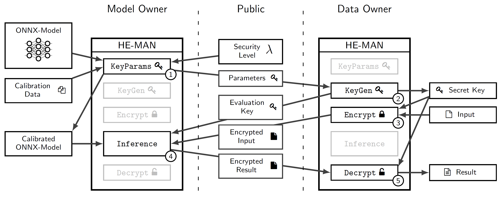
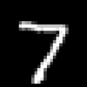

# he-man-tenseal


## setup
- create a virtual env
- install project dependencies: `pip install .`

## usage
run this command for an interactive help
```
he-man-tenseal --help
```

note:
all parameters defined in `config.py` can also be set by setting enviorment variables

### MNIST demo
This is a step-by-step manual to demonstrate the interface of `he-man-tenseal` by classifying MNIST images.<br/>
Input sample: `demo/mnist/input.npy`<br/>



**Step 0: Model Training (optional)**<br/>
Train an MNIST classifier by executing `scripts/train_mnist_model.py`. The resulting model will be saved at `demo/mnist/mnist.onnx`. This step is optional, as the repository contains a pre-trained model.

**Step 1: Keyparams Generation**<br/>
The model owner calls `keyparams` together with the model (`-m`) and a calibration-data container (zip/npz) (`-c`). The calibration-data is a set of sample inputs that is used to derive meta-data for the subsequent key generation. The keyparams are saved at the defined location (`-o`). Moreover, a calibrated model is generated and saved with the suffix `_calibrated` in the filename (i.e. `mnist.onnx` => `mnist_calibrated.onnx`). The calibrated model should be used for inference.
```
he-man-tenseal keyparams -m demo/mnist/mnist.onnx -c demo/mnist/calibration-data.zip -o demo/mnist/keyparams.json
```

**Step 2: Key Generation**<br/>
The client generates the keys using the previously computed keyparams (`-i`). The resulting secret key is saved at the defined location (`-o`) together with the evaluation key whose filename is appended by `.pub`.
```
he-man-tenseal keygen -i demo/mnist/keyparams.json -o demo/mnist/key
```

**Step 3: Encryption**<br/>
The client encrypts input data using the key (`-k`) and the cleartext input (`-i`). The encrypted input is saved at the defined location (`-o`).
```
he-man-tenseal encrypt -k demo/mnist/key -i demo/mnist/input.npy -o demo/mnist/input.enc
```

**Step 4: Inference**<br/>
The model owner performs inference using the calibrated model (`-m`), the public evaluation key (`-k`) and the encrypted input (`-i`). The encrypted result is saved at the defined location (`-o`).
```
he-man-tenseal inference -m demo/mnist/mnist_calibrated.onnx -k demo/mnist/key.pub -i demo/mnist/input.enc -o demo/mnist/output.enc
```

**Step 5: Decryption**<br/>
The client decrypts the encrypted result (`-i`) using the secret key (`-k`). The cleartext result is saved at the defined location (`-o`).
```
he-man-tenseal decrypt -k demo/mnist/key -i demo/mnist/output.enc -o demo/mnist/output.npy
```

**Result:**<br/>
The result `output.npy` contains a numpy-array of length ten, where output neuron seven has the hightest output activation:<br/>
[-10.61485652  -1.41687503  -0.2596516    3.86985058  -4.38157674<br/>
  -7.26738544  -8.80905716  **12.59595965**  -0.35903776   7.6266054 ]

## development setup

- create a virtual env
- install project editable: `pip install -e ".[dev]"`
- install commit hooks: `pre-commit install`

### run all checks
```
pre-commit run --all-files
```
### run specific checks
```
pre-commit run --all-files [HOOK_ID]
```

check `.pre-commit-config.yaml` for `HOOK_ID`

## build
```
python -m build
```
wheels will be in `dist` folder

## test
run pytest using:
```
pre-commit run pytest
```
this will generate a test coverage report in `htmlcov`

## citing HE-MAN
```bibtex
@inproceedings{10.1145/3589883.3589889,
  author = {Nocker, Martin and Drexel, David and Rader, Michael and Montuoro, Alessio and Sch\"{o}ttle, Pascal},
  title = {HE-MAN – Homomorphically Encrypted MAchine Learning with ONnx Models},
  year = {2023},
  isbn = {9781450398329},
  publisher = {Association for Computing Machinery},
  address = {New York, NY, USA},
  url = {https://doi.org/10.1145/3589883.3589889},
  doi = {10.1145/3589883.3589889},
  booktitle = {Proceedings of the 2023 8th International Conference on Machine Learning Technologies},
  pages = {35–45},
  numpages = {11},
  keywords = {Machine Learning as a Service, Homomorphic Encryption, Secure and Privacy-Preserving Machine Learning},
  location = {Stockholm, Sweden},
  series = {ICMLT '23}
}
```